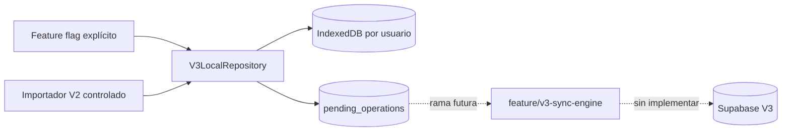

# Nico Fit V3: almacenamiento local del cliente

## Alcance

La capa V3 usa IndexedDB y permanece desactivada por defecto. No se importa desde `js/app.js`, no modifica `js/sync.js`, no usa Supabase y no cambia el camino V2. Sus módulos se precachean para permitir pruebas internas de la PWA sin red.

## Arquitectura



Cada usuario recibe una base física distinta: `nico-fit-v3-local:<user-id codificado>`. Además, cada fila conserva `owner_id` y el repositorio rechaza registros con otro propietario. El perfil `guest` no puede abrir V3.

`V3LocalRepository` es la única entrada para mutaciones. Una transacción IndexedDB guarda la entidad y su operación pendiente juntas. La UI no conoce stores, requests ni transacciones de IndexedDB.

## Stores

| Store | Propósito | Índices principales |
| --- | --- | --- |
| `workout_sessions` | Sesiones, estado y versiones | `session_date`, `status`, `sync_status`, `updated_at` |
| `session_exercises` | Apariciones ordenadas de ejercicios | `session_id`, `exercise_catalog_id`, `exercise_key` |
| `exercise_sets` | Series ordenadas y tombstones | `session_exercise_id` |
| `exercise_catalog` | Identidad estable local | `stable_key` único por usuario/base |
| `pending_operations` | Outbox persistente | `status`, `[entity, record_id]`, `created_at` |
| `migration_map` | Trazabilidad e idempotencia V2→V3 | `source_key` |

Los registros usan UUID creados por Web Crypto. Las importaciones usan UUID v5 compatibles, derivados con SHA-256 de una clave estable que incluye el usuario y la identidad V2. Repetir la importación conserva los mismos IDs.

`remote_version` guarda la última versión confirmada por servidor y no cambia durante una edición offline. `local_revision` protege contra ediciones locales obsoletas. Cada operación conserva `base_remote_version`, `local_revision`, payload, cantidad de intentos y último error.

## Operaciones y recuperación

Las mutaciones soportadas son `insert`, `update` y `soft_delete`. Sus estados persistentes son `pending`, `syncing`, `synced`, `conflict` y `failed`.

- Repetir una llamada con el mismo `operation_id` devuelve el resultado existente y no incrementa la revisión.
- Un soft delete fija `deleted_at`; el tombstone no puede actualizarse ni resucitarse desde el repositorio.
- Al abrir la base, toda operación que quedó `syncing` vuelve a `pending`, conserva su UUID e intentos y registra que el proceso anterior se interrumpió.
- `claimPendingOperations()` cambia a `syncing` dentro de una transacción. `retryOperation()` devuelve operaciones `failed` o `conflict` a `pending`.
- `setOperationStatus(..., {remoteVersion})` permite que el futuro sync confirme una versión remota sin perder revisiones locales posteriores.
- Si se revisa un registro importado que nunca existió en el servidor, su primera operación se clasifica como `insert`; una edición posterior a un insert ya encolado conserva el orden insert→update.

Las sesiones pueden consultarse por fecha, estado de sesión, estado de sincronización, ID de catálogo o clave estable de ejercicio. Los tombstones quedan excluidos salvo que se soliciten explícitamente.

## Feature flag

El flag `nicoFit.v3.localStorage.enabled` no existe inicialmente. Para una prueba interna explícita desde la consola del navegador:

```js
const v3 = await import('./js/v3/client-storage.js');
v3.setV3LocalStorageEnabled(true);
const repository = await v3.V3LocalRepository.open({userId: '<supabase-user-uuid>'});
```

Para desactivarlo:

```js
v3.setV3LocalStorageEnabled(false);
repository.close();
```

Apagar el flag no borra datos. La aplicación V2 continúa usando `localStorage` y su sincronización actual.

## Importación V2 controlada

`importV2LocalData(repository, v2Data)` recibe una copia explícita de los datos V2 del usuario ya autenticado. No lee automáticamente perfiles guest ni namespaces de otros usuarios.

Reglas:

1. Una sesión V2 finalizada conserva fechas, timestamps, duración y RPE. Una sesión incompleta queda `pending_review`.
2. Un workout se asocia a una sesión solo si existe exactamente una candidata en esa fecha.
3. Si no existe una candidata o hay varias, se crea una sesión independiente por workout, marcada `reconstructed` y `pending_review`; no se elige un padre arbitrario.
4. El orden de ejercicios queda señalado como sintético.
5. El valor V2 `reps` se conserva en `legacy_value_snapshot`. No se copia a `reps` ni `duration_seconds` porque V2 no distingue ambas unidades.
6. La marca `done` se conserva como snapshot, pero la serie importada no se marca completada hasta resolver la medición.
7. Ejercicios vacíos se registran como `skipped` y no crean entidades.
8. Registros importados pendientes quedan con `sync_status = conflict` y no generan operaciones remotas automáticas.
9. `migration_map` y los UUID deterministas hacen que repetir o recuperar la importación no duplique datos.

## Validación

```powershell
npm run test:v3:storage
npm test
node --check js/v3/client-storage.js
node --check js/v3/feature-flags.js
node --check js/v3/indexed-db.js
node --check js/v3/repository.js
node --check js/v3/import-v2.js
git diff --check
```

Las pruebas usan `fake-indexeddb`, una implementación aislada en memoria del API IndexedDB. Cada caso crea su propio `IDBFactory`; no depende del navegador ni de Supabase.

## Conexión futura con `feature/v3-sync-engine`

1. Abrir el repositorio únicamente después de resolver el usuario autenticado y comprobar el flag.
2. Reclamar un lote pequeño con `claimPendingOperations()`.
3. Traducir el payload local al formato snake_case del esquema V3 y enviar el UUID existente.
4. Para updates y tombstones, enviar `base_remote_version + 1` y tratar HTTP 409 como `conflict`.
5. Marcar `synced` solo con confirmación del servidor y guardar la versión devuelta.
6. Marcar errores recuperables como `failed`, aplicar backoff fuera del repositorio y reutilizar el mismo `operation_id`.
7. Descargar cambios por `updated_at`, aplicar primero tombstones y nunca sustituir un registro con operaciones locales pendientes sin resolver.
8. Mantener la escritura remota detrás de otro flag; activar lectura, escritura y cutover en etapas separadas.

## Riesgos abiertos

- IndexedDB puede ser desalojado por el navegador bajo presión de almacenamiento; antes del cutover habrá que solicitar persistencia cuando la plataforma lo soporte y comunicar su estado.
- El importador conserva ambigüedades, pero todavía falta una UI para revisarlas y aprobarlas.
- La outbox conserva payloads completos; se deberá definir compactación después de confirmar operaciones sin perder trazabilidad.
- El futuro motor debe coordinar múltiples pestañas o procesos mediante Web Locks o un lease persistente para evitar dos consumidores simultáneos.
- Falta medir el comportamiento y los límites de almacenamiento en iOS PWA y Android instalados.
