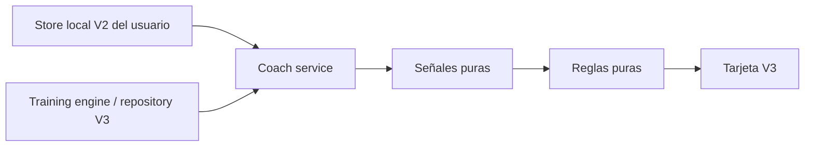

# Coach V3 local y determinístico

## Arquitectura

`coach-service` lee el perfil V2 local **del usuario del repository** con
`loadLocalData(userId)` y consume `training-engine.history()`. No importa
entrenamientos V2 ni escribe datos. Readiness, fútbol y rendimiento de partido
todavía tienen como fuente V2; gimnasio tiene como fuente el grafo V3.

`coach-signals` calcula señales puras con fecha explícita. `coach-rules` produce
la salida estructurada sin DOM, red, aleatoriedad ni modelos externos.
`coach-presentation` crea una tarjeta DOM con `textContent`, detalles «¿Por
qué?», datos originales y ajustes. La UI no consulta IndexedDB directamente.



Flag `v3.coach.enabled` apagado por defecto. Habilitarlo explícitamente para
pruebas **no** habilita training, storage ni sync. Solo se muestra dentro de
la pantalla V3 ya habilitada. `Actualizar Coach` refresca su tarjeta sin
reconstruir formularios. Al cambiar el día se refresca la tarjeta; la sesión
activa conserva su fecha original. La decisión evalúa el día actual.

## Señales y umbrales iniciales

Estos son criterios generales iniciales, no umbrales clínicos ni prescripciones
individuales validadas:

| Señal/regla | Comportamiento |
| --- | --- |
| Readiness | Promedio sueño/energía/frescura 1–5 escalado a 100, menos 3 puntos por unidad de dolor sobre 2; clamp 0–100. Fatiga V2 se convierte a frescura como `6 - fatigue`. |
| Score <60 o frescura ≤2 | Reducir series antes de subir carga; con score bajo quitar 2 de un objetivo ≥3, sin bajar de 1. |
| Score <40 o sueño/energía ambos 1 | Priorizar recuperación. |
| Dolor ≥4 | Bloquear progresión; sugerir -10% de carga de referencia y una reducción de series. No localizar automáticamente dolor a un ejercicio. |
| Dolor ≥7 | Priorizar recuperación. |
| Viernes o partido en ≤1 día | Activación: hasta 2 series, RIR 4, referencia de carga -20%; dolor relevante convierte a recuperación. |
| Partido en 2 días | Evitar progresión de piernas; personalizados sin región declarada reciben criterio conservador. |
| Fútbol reciente intenso | RPE ≥8 y duración × RPE ≥480 AU en días calendario 0–2: reducir series. |
| Carga semanal creciente | Fútbol +15% o gym +20% frente al promedio de las cuatro ventanas anteriores: reducir volumen. |
| Domingo | Preservar recuperación. |
| Progresión | Reutiliza V3/V2, martes/jueves diferenciados. Requiere sesión anterior del mismo día/tipo, todos los objetivos completos, RIR conocido, RPE ≤8 y readiness válido. Conflictos bloquean aumentos. |

Prepartido nunca habilita progresión; recuperación/dolor alto pueden ser más
restrictivos. Ningún ajuste se aplica automáticamente. `suggestedLoad: null`
significa que no hay referencia, no carga cero.

El historial elegible para progresión usa el mismo día semanal como proxy del
tipo de sesión porque el esquema actual no guarda una identidad de rutina en
la sesión. También exige catálogo estable y misma ocurrencia del ejercicio;
no mezcla nombres ni repeticiones. Se excluyen reconstruidas y sesiones
posteriores al inicio de la activa. Esta aproximación debe revisarse antes de
soportar varios tipos de rutina en el mismo día.

## Carga y patrones personales

Carga fútbol: minutos × RPE. Carga gym: duración real de sesión en minutos ×
RPE, solo en sesiones finalizadas con series completadas y duración/RPE válidos.
No se suma tonelaje y AU ni se infiere carga desde series incompletas.

Ventanas: últimos 7 días inclusive hoy, comparados con los cuatro bloques
previos de 7 días. Se exige al menos un registro válido en **cada** bloque
previo para calcular porcentaje. Esto es carga **registrada**, no cobertura
completa; ausencia de registro no equivale a descanso. Baseline cero no genera
porcentaje. Datos futuros, inválidos y borrados se excluyen.

Patrón personal: al menos 6 sábados únicos dentro de 12 semanas, con frescura
registrada y carga gym jueves/viernes previa. Se separan mitad inferior y
superior por carga, mínimo 3 por grupo y separación real en el punto de corte.
Se muestran medias de frescura; rendimiento informado se compara solo si hay
al menos 3 registros por grupo. Se etiqueta «asociación observada» y «no
demuestra causalidad». Los patrones son informativos: no modifican umbrales ni
justifican aumentos. Otras cargas y calidad del registro pueden explicar la
asociación.

## Salida y ejemplos

Salida: `readinessScore`, `recommendationLevel`, `title`, `summary`, `reasons[]`,
`exerciseAdjustments[]`, `warnings[]`. Cada ajuste referencia el UUID de la
**ocurrencia** (`exerciseId`), acción, carga, series, RIR y explicación.

- Martes score 100, press anterior 3×10 con 50 kg/RIR 2/RPE 7:
  «Progresar carga de forma controlada», 52.5 kg. Motivo: objetivos completos y
  margen; se muestra la sesión anterior.
- Martes sueño/energía/frescura 2/5: «Reducir volumen y mantener margen»,
  objetivo 3 → 1 serie, carga de referencia conservada, RIR 3.
- Jueves después de fútbol 90 min/RPE 9: reducir series; fútbol intenso reciente
  y partido en 2 días figuran como motivos.
- Viernes con buen historial: activación, sin aumentos; dolor relevante puede
  recomendar recuperación.
- Cuatro semanas registradas de fútbol 500 AU y semana actual 590 AU:
  se muestra «+18% vs promedio registrado» y reducción de volumen.

## Validación

```powershell
npm run test:v3:coach
npm test
rg --files js test scripts -g '*.js' -g '*.mjs' | ForEach-Object { node --check $_; if ($LASTEXITCODE) { throw "Sintaxis inválida: $_" } }
node --check sw.js
git diff --check
```

16 tests Coach y suite completa 108/108. Cubren martes alto/bajo, jueves
postfútbol, viernes, dolor, series incompletas, RIR desconocido, RPE alto,
conflictos actuales/históricos, poco historial, patrones suficientes, carga
creciente, identidad/tipo, estabilidad, entradas inválidas, flag independiente,
lectura offline por usuario y DOM seguro. No se ejecutaron consultas remotas.

## Riesgos y GO/NO-GO para cutover-prep

GO técnico del Coach, condicionado a completar el orden acordado más abajo
antes de iniciar `v3-cutover-prep`. No implica autorizar cutover ni iniciar
su preparación en esta rama.

NO-GO para reemplazar V2 hasta resolver:

- Persistencia V3 de readiness/fútbol/partidos o puente versionado de esas
  entidades; hoy el Coach depende de su perfil V2 local.
- Identidad de rutina/tipo, región corporal personalizada y unidades de
  prescripciones compuestas, sin inferencias ambiguas.
- Resolución explícita de conflictos, sync del grafo de entrenamiento en
  staging y validación prolongada en PWA instalada.
- Revisión de umbrales con registros personales fiables, cobertura de carga
  y límites de duración (gym >24 h se excluye por inválido).
- Validación de usabilidad móvil y PWA instalada.

## Prueba manual breve (Edge, 2026-09-15)

Fixture sintético local con los módulos reales de señales/reglas/presentación,
sin Auth, Supabase, escrituras ni cambios de flags. Verificado:

| Caso | Tarjeta y ajuste observado |
| --- | --- |
| Martes readiness 100 | Progresión 50 → 52.5 kg, 3 series, RIR 2; objetivos completos explicados. |
| Viernes readiness 100 | Activación 40 kg, 2 series, RIR 4; prioridad prepartido visible. |
| Dolor 4/10 | Reducir carga a 45 kg y 2 series, RIR 3; dolor bloquea progresión aun con score 94. |
| Conflicto sync | Mantener 50 kg, sin aumentos; advertencia de revisión pendiente. |

«¿Por qué?» expande motivos y datos originales en todos los casos; consola sin
errores. Se ajustó la explicación del conflicto para no sugerir que faltaron
objetivos cuando el bloqueo corresponde al sync. Suite completa reejecutada
para regresiones V2/storage/training/sync. Esto no sustituye integración remota
ni prueba de PWA instalada.

Orden acordado antes de preparar cutover:
1. `v3-readiness-football-bridge`
2. `v3-conflict-ui`
3. `v3-observability`
4. `v3-routine-identity`
5. `v3-cutover-prep`

No calcula diagnósticos ni probabilidades de lesión; no usa OpenAI/API/modelos.
Las recomendaciones no reemplazan los registros ni ocultan datos originales.
