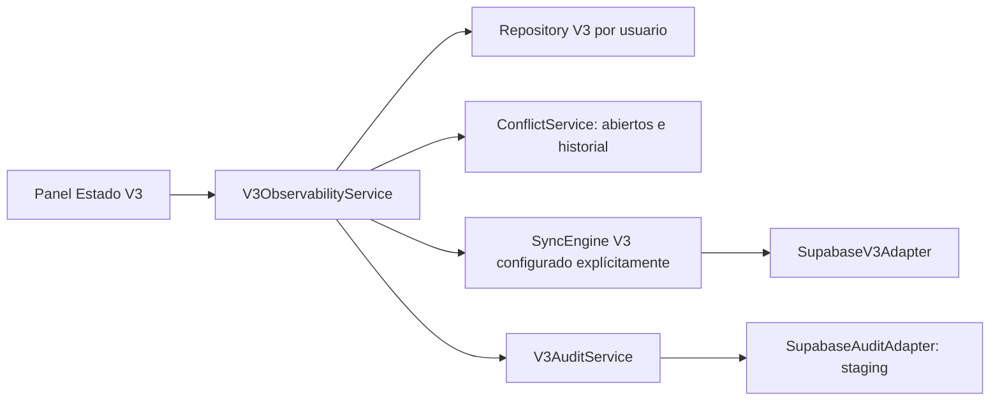

# Observabilidad V3

Implementación en `feature/v3-observability`. V2 sigue siendo el camino normal. No hay cutover, envío automático de auditoría ni cambios en `js/sync.js` V2. Los flags nuevos `v3.observability.enabled` y `v3.audit.enabled` están apagados por defecto y no habilitan otros flags.

## Arquitectura y flujo



- `diagnostic-model.js`: conteos, backoff y errores seguros; nunca devuelve mensajes originales del servidor.
- `observability-service.js`: API `snapshot()`, `syncNow()` y `retryFailed()`. Los componentes consumen esta API y no conocen stores de IndexedDB.
- `observability-runtime.js`: inyección interna explícita del motor y auditoría por usuario. Verifica el propietario, publishable/anon key y URL exacta del staging autorizado. No crea clientes remotos.
- `observability-entry.js` y `observability-ui.js`: panel separado, DOM seguro, detalles técnicos nativos y controles accesibles.
- `audit-service.js` y `supabase-audit-adapter.js`: proyección mínima de decisiones y fallos críticos, entregas persistentes e idempotentes y lecturas paginadas.

El repository agrega métodos de diagnóstico sobre los stores existentes. No cambia la versión ni el modelo de entidades de IndexedDB. El motor registra inicio, fase y final de cada intento; estas escrituras son best effort para que un fallo de diagnóstico no impida confirmar operaciones de dominio.

## Estado expuesto

| Campo | Significado |
|---|---|
| `online`, `summary` | Conectividad declarada por el navegador y explicación amigable; online no garantiza acceso al servidor. |
| `lastAttempt` | Inicio, fin, estado, fase y conteos del último intento. Secuencia persistente para desempatar timestamps. |
| `lastSuccessfulSyncAt` | Último ciclo remoto completado sin fallos; no implica ausencia de conflictos ni que toda la cola haya sido procesada. |
| `lastError`, `lastErrorAt` | Último error histórico, categorizado y saneado; se conserva aunque un intento posterior tenga éxito. |
| `checkpoints` | Cursor por entidad: timestamp remoto y UUID. No reemplaza datos locales. |
| `operations`, `entities` | Conteos por estado y entidad, incluidos `superseded` internos. |
| `queue` | Operaciones no finalizadas y bytes aproximados de su JSON UTF-8; no es la cuota real de IndexedDB. |
| `backoff` | Espera activa, próxima fecha, fallos elegibles y bloqueados por tipo/límite de intentos. |
| `lock` | Lease activo/vencido, backend y fechas; nunca incluye owner token. |
| `openConflicts`, `resolutionPending`, `recentResolutions` | Conflictos abiertos, decisiones pendientes de confirmación y últimas diez decisiones con versiones y confirmación. |
| `flags`, `actions`, `audit` | Booleans conocidos, disponibilidad de acciones y estado de entrega de auditoría. |

Se conservan hasta 30 registros recientes de intentos, sin podar intentos todavía `running`. Último éxito y último error tienen registros durables separados. Los eventos críticos y las decisiones auditables no se eliminan con esa poda. Un `running` abandonado se muestra como el último intento; el lease vence y la cola recupera `syncing` mediante el mecanismo V3 existente.

`Sincronizar ahora` requiere flag de sync, motor configurado, conexión y ausencia de lease activo. `Reintentar fallidos` aparece cuando hay fallos elegibles; usa el mismo lock y reencola atómicamente respetando backoff y máximo de intentos. No desbloquea conflictos ni fuerza reintentos permanentes. Reencolar no equivale a confirmar: `synced` sigue dependiendo de respuesta remota.

## UI y privacidad

El botón **Estado V3** sólo se agrega con observabilidad habilitada. Para abrir el panel se requiere autenticación y almacenamiento V3. Incluye resumen, online/offline, tamaño de cola, contador de conflictos y fecha del último sync confirmado. La vista técnica es expandible y conserva su estado durante actualizaciones.

El panel usa `role=dialog`, `aria-modal`, fondo inert, captura de Tab, Escape, foco inicial en Cerrar y devolución del foco. Los mensajes usan `role=status`; los botones visibles tienen altura mínima de 44 px. Actualización explícita y eventos online/offline; no hay polling entre pestañas. Para ver cambios hechos en otra pestaña se usa **Actualizar estado**.

La proyección excluye payloads, notas, nombres de ejercicios, correos, claves, tokens y mensajes originales. Los UUID de entidad/decisión son metadatos necesarios: no se exportan fuera del usuario autenticado. No hay componentes que creen un cliente Supabase ni lean directamente IndexedDB.

## Auditoría remota mínima

`supabase/migration-v3-observability.sql` crea de forma aditiva e idempotente `nico_fit_v3.operational_audit`. Requiere el esquema V3 existente. No modifica tablas V2.

- Eventos: `conflict_resolution` y `sync_failure`.
- Campos: UUID de evento, `user_id`, entidad/UUID cuando corresponde, estrategia, revisión local, versión base/remota, `occurred_at` y `received_at` fijado por servidor. Fallos sólo incluyen categoría y código permitido.
- No hay payload completo, notas, texto arbitrario ni credenciales.
- RLS: authenticated puede insertar/leer únicamente sus filas; anon no tiene acceso. Sin UPDATE/DELETE normal; trigger append-only incluso para un UPDATE administrativo.
- `keep_both` sólo es válido para `football_sessions`, según la semántica ya aprobada de conflictos.
- UUID de decisión/intento estable como clave idempotente. Ante duplicado, el adaptador verifica que los metadatos coincidan; no acepta silenciosamente otra decisión.
- Entregas locales `pending/syncing/sent/failed`. Se confirman sólo con respuesta remota; recuperación de `syncing`, backoff transitorio, máximo cinco intentos y no reintento automático de fallos permanentes. Batch de 25.

La auditoría se envía únicamente con `v3.audit.enabled=true` y adaptador inyectado, bajo el mismo lock de sync. `syncNow()` intenta flush después del ciclo; un fallo de Auth previo al ciclo queda local hasta una futura conexión/autenticación o flush explícito. No hay doble escritura de las entidades V2/V3.

Un evento acredita **una decisión declarada por el cliente**, no certifica por sí solo que el servidor haya aplicado la resolución. La confirmación de operaciones/resoluciones sigue siendo información separada. La API de observabilidad no depende del formato interno de los stores.

## Reproducción local y staging

```powershell
npm ci
npm test
npm run test:v3:observability
npm run serve:v3:observability:manual
```

Abrir `http://127.0.0.1:41742/` en Edge. La fixture usa IndexedDB real del navegador y adaptador simulado sin HTTP remoto; activa flags explícitamente sólo en ese origen de prueba. Probar móvil 390 px, detalles/teclado/Escape, pendiente + fallo de red, backoff vencido + reintento y offline/online. No carga formularios, store ni sync V2.

Para integración, usar exclusivamente `nico-fit-v3-staging`, ref `tmydirzzlmlmtjgwqcgh`. Verificar nombre/ref en el dashboard antes de aplicar el SQL. La etiqueta `main PRODUCTION` de Supabase corresponde a la rama del proyecto **staging**, no autoriza usar `gym-futbol` productivo.

1. Aplicar `migration-v3-observability.sql` en el SQL Editor del staging. Reejecutarlo para comprobar idempotencia.
2. Conservar fuera de Git `.env.v3-staging.local` con `SUPABASE_STAGING_PROJECT_REF`, `SUPABASE_STAGING_URL`, `SUPABASE_STAGING_PUBLISHABLE_KEY` y EMAIL/PASSWORD de `SUPABASE_STAGING_USER_A` y `SUPABASE_STAGING_USER_B` (dos usuarios Auth sintéticos distintos).
3. Ejecutar:

```powershell
npm run test:v3:observability:staging
```

El runner valida URL/ref/key antes de crear clientes. No usa secret/service role. Escribe fixtures sintéticos con UUID nuevos y fecha 2040; no migra datos personales ni ejecuta cutover. El resultado queda en `.tmp/v3-observability-staging-result.json`, ignorado por Git. Las fixtures y eventos quedan en staging para inspección, sin borrado físico automático.

## Resultados del 2026-09-15

Suite completa: **168/168**, con **20 tests** nuevos de observabilidad. Incluye conteos, bytes sin payload, checkpoints persistentes, última confirmación durable, backoff, error de red/Auth, offline/online, conflictos/resoluciones, dos instancias, recuperación de lease, aislamiento, flags apagados, cuota de diagnóstico y UI con DOM seguro.

Validación final: `node --check` pasó para los 73 archivos JavaScript/MJS del repositorio y `git diff --check` no encontró errores.

Integración final: **9/9 bloques**, run `52563412-e9f2-4076-8c1f-e1ca9a389f31`:

| Bloque | Resultado |
|---|---|
| Auth A/B, PostgREST y anon | Tabla visible para authenticated; anon rechazado con 42501. |
| Cola y sync real | Insert confirmado versión 1, checkpoint guardado, sin notas en diagnóstico. |
| Red y backoff | Fallo simulado en envío, conservación del último éxito; reintento elegible confirmado en servidor real. |
| Conflicto/resolución/auditoría | Conflicto de versión real, aceptar remoto, evento mínimo; reenvío sin duplicados. |
| RLS y append-only | B no lee/inserta auditoría de A; UPDATE/DELETE normales rechazados. |
| Sesión expirada | Logout real, error Auth saneado; login posterior permite enviar evento crítico. |
| Offline/online | Offline no escribe remotamente; vuelta online registra ciclo confirmado. |
| Dos instancias | Cola compartida, Web Locks + lease, segundo motor excluido y un solo insert remoto. |
| Paginación | Dos páginas de auditoría distintas, sin payloads ni claves. |

SQL aplicado dos veces en el staging: ambas ejecuciones devolvieron `Success. No rows returned`.

Prueba manual Edge: desktop y ancho 390 px; apertura/cierre con mouse/teclado, foco, detalles conservados tras sync, botones de 44 px, resumen/último éxito, fallo seguro, reintento visible sólo tras backoff y desaparición al confirmar, offline deshabilita sync. Es una prueba de navegador, no standalone PWA ni dispositivo físico.

### Diferencias frente a PGlite/local

- PGlite valida reejecución SQL, roles simulados, restricciones y trigger. Supabase agrega Auth real, grants/RLS a través de PostgREST y serialización HTTP.
- El SDK real devuelve `AuthSessionMissingError` con HTTP 400 al faltar sesión. Se corrigió el adaptador **V3** para clasificarlo como Auth/401; los fallos de red/5xx siguen transitorios. V2 no cambió.
- Un reloj artificial adelantado para backoff hizo parecer vencido un lease basado en reloj real. Se corrigió el runner restaurando reloj real antes de la prueba concurrente; no se alteró la política de leases.
- El runner remoto usa fake-indexeddb con repository/motor reales; la prueba Edge cubre IndexedDB nativo con remoto simulado. No sustituye la prueba prolongada de PWA + servidor en teléfono.

## Rollback y riesgos abiertos

Rollback funcional: apagar observabilidad/audit y retirar la inyección del runtime. V2 permanece operativo. Conservar tabla/eventos y metadata local: no existe rollback normal que borre auditoría. Para deshabilitar ingestión en staging puede revocarse INSERT a authenticated, conservando SELECT y registros; cualquier destrucción administrativa requiere política y autorización aparte.

| Riesgo/limitación | Decisión antes de producción |
|---|---|
| Auditoría crece y FK `auth.users` usa RESTRICT | Definir retención, exportación y procedimiento autorizado para eliminación de cuenta; no purgar automáticamente. |
| Auditoría cliente no es confirmación remota de resolución | Diseñar eventos de confirmación/ingestión servidor si se requiere evidencia más fuerte. |
| Fallos permanentes o máximo de intentos en auditoría | Revisión explícita y futura recuperación administrativa; no bucle infinito. |
| Snapshot lee metadata/cola y conflictos | Medir historial grande antes de producción; tamaño mostrado es aproximado. |
| Pestaña cerrada durante observación | Cola/leases siguen recuperación existente; intentos running históricos pueden requerir diagnóstico posterior. |
| Flags locales e inyección de staging | No son controles de seguridad; RLS/Auth siguen siendo la barrera. No hay conexión productiva habilitada. |
| Suspensión prolongada y teléfono físico | Pendientes standalone PWA, prueba prolongada en dispositivo y contención/suspensión prolongadas. |

**GO para revisión/commit de esta rama y empezar `feature/v3-routine-identity`. NO-GO para cutover o activación productiva.** La auditoría remota está validada sólo en staging; no hay merge, push ni deploy en esta entrega.
