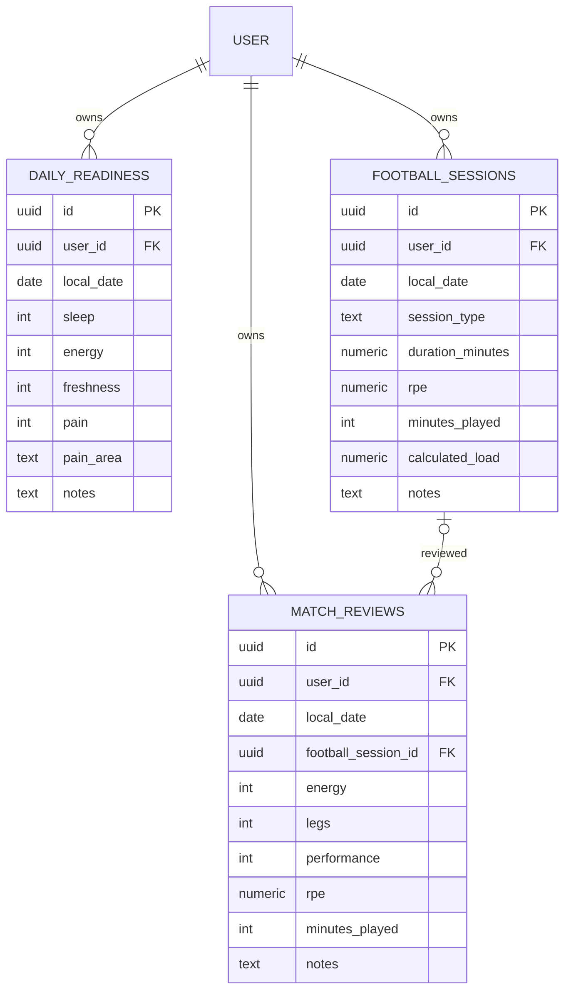

# Señales V3: readiness, fútbol y reviews

## Modelo aditivo



Todas incluyen created/updated/deleted timestamps, version, migration_status,
migration_note y source_payload. Readiness es único por usuario/fecha, incluso
si está borrado: el tombstone no se recicla. Fútbol admite múltiples UUIDs por
día y tipo. Review puede no tener vínculo explícito; un vínculo debe apuntar a
un partido vivo del mismo usuario/fecha. Hay FK compuesta de propiedad y trigger
de integridad. Reviews no se asignan por coincidencia de fecha automáticamente.

UUIDs generados antes de persistir. Readiness nuevo usa UUID determinístico de
usuario/fecha; al editar uno importado mantiene su UUID. Fútbol/reviews usan UUID
aleatorio por ocurrencia. Nunca se usa nombre o tipo como identidad V3.

Carga fútbol es `duration_minutes * rpe`, calculada localmente y como columna
generada en servidor; nunca se acepta del input como autoridad. RPE admite una
cifra decimal. `minutes_played: null` es desconocido; `0` se conserva como cero.
RPE/minutos de review opcionales. Las escalas de readiness/energy/legs/performance
son enteras; notas y zona de dolor tienen límites explícitos.

## Storage y escrituras

IndexedDB versión 3 agrega tres stores e índices por fecha, estado y updated_at,
sin borrar stores existentes. Cada DB sigue siendo por usuario.

`V3SignalsRepository` es el único servicio de escritura de señales nuevas:
validación → repository V3 → transacción de entidad/cola/guards → retorno local.
Ediciones exigen expectedLocalRevision. Fecha/identidad no se modifican.
Soft delete de fútbol incluye reviews vinculadas, sin borrar físicamente.
Conflictos de padre también bloquean operaciones de review para revisión.

API interna para UI futura (no conectada a los formularios V2):

```js
const signals = new V3SignalsRepository({ repository });
const row = await signals.save('daily_readiness', {
  local_date: '2026-09-15', sleep: 5, energy: 4, freshness: 3,
  pain: 0, pain_area: '', notes: ''
});
await signals.save('daily_readiness', { ...row, freshness: 4 }, {
  id: row.id, expectedLocalRevision: row.local_revision
});
await signals.save('football_sessions', {
  local_date: '2026-09-15', session_type: 'training',
  duration_minutes: 90, rpe: 8, minutes_played: null, notes: ''
});
```

No hay mirroring automático, listener de V2 ni dual write. Los formularios V2
siguen escribiendo solo V2. El servicio de señales escribe solo V3. Los flags
seleccionan la fuente del Coach, no redirigen a escondidas los formularios.
Al probar Coach con V3, ingresar/importar señales mediante este servicio; un
registro recién creado en la UI V2 no aparecerá automáticamente en V3.

## Flags y sync

- `v3.signals.enabled`: servicio y fuente V3 del Coach. Off por defecto.
- `v3.signals.sync.enabled`: nuevas entidades en sync. Off por defecto.
- Storage/training/coach/sync existentes conservan sus flags independientes.

Activar señales no habilita training, coach ni red. Sync requiere además su
flag V3 existente. Sin el flag remoto de señales, el motor no consulta estas
tablas ni reclama sus operaciones. Esto protege proyectos con esquema anterior.

Se extiende el protocolo con whitelist de campos/user_id y trazabilidad.
Orden de pull: entrenamiento existente → readiness → fútbol → reviews.
Se reutilizan paginación/checkpoints, lock/lease, claim atómico, backoff,
confirmación real, next version exacta, conflictos y tombstones. No se modifica
`js/sync.js` V2. Conflictos en señales bloquean aumentos en Coach y se muestran
como warnings; los valores locales siguen visibles.

## Coach

`coach-service` no lee store/tablas V2 directamente. `coach-context` selecciona
fuente explícita: V3SignalsRepository si señales está enabled, adaptador local
V2 por usuario mientras está disabled. **No fallback** a V2 cuando V3 está
enabled y vacío. Se conserva la fórmula validada sin convertir null en cero.
Readiness/fútbol válidos alimentan señales; registros pending_review no se usan.
Reviews vinculadas a un fútbol borrado se excluyen.

## Importación controlada

`importOwnedV2Signals(signals)` lee solo el perfil local del usuario del
repository. `importV2Signals(signals, snapshot)` es la entrada para fixtures o
snapshots expresamente asociados al mismo usuario; nunca pasar un perfil guest
o un snapshot de otro usuario.

Identidad V2: readiness/reviews por fecha; fútbol por fecha/tipo. UUID target
determinístico por usuario/origen. Entidad válida + mapping + operación insert
se guardan atómicamente. Reejecutar no duplica cola ni registros. Tracing guarda
source payload, status, nota y timestamps; no se sobrescribe V2.

Conversión explícita de fatiga a frescura, sin adivinar valores faltantes.
Solo tipos de fútbol reconocidos se convierten. Duplicados diferentes, tipos
desconocidos y reviews sin UUID de partido quedan como decisiones pending_review
con sus payloads íntegros; no se crea una entidad que el Coach pueda confundir
con un registro confirmado. Tombstones de V2 se marcan skipped. Si la fuente
cambia/se borra luego de importar, entidad/cola/mapping se bloquean para revisión,
conservando origen inicial y payload nuevo. No se sobrescribe V3 ni se resucita.

No hay backfill remoto automático ni cutover; importación local y schema son
pasos separados. Resolución de decisiones queda para UI explícita posterior.

## SQL y reproducción aislada

1. Aplicar schema V3 existente en entorno aislado, luego
   `migration-v3-signals.sql`. No ejecutar contra producción.
2. Solo staging: aplicar `staging-v3-signals-api-grants.sql`; comprobar exposición
   de `nico_fit_v3` en PostgREST. Authenticated recibe select/insert/update, sin
   DELETE; anon no recibe permisos. RLS verifica user_id y FK/trigger el padre.
3. Cargar señales sintéticas mediante servicio y habilitar sync de señales
   explícitamente solo contra staging.
4. Rollback aislado: exportar datos, apagar flags y aplicar
   `rollback-v3-signals.sql`. Borra solo las tres tablas nuevas y su guard.
   IndexedDB se conserva; desactivar flags no elimina datos ni downgradea DB.

Tests reproducibles, sin red:

```powershell
npm run test:v3:signals
npm test
node --check js/v3/signals-repository.js
node --check js/v3/signals-validation.js
node --check js/v3/import-v2-signals.js
node --check js/v3/coach-context.js
git diff --check
```

17 tests nuevos; suite 125/125. Incluyen reload, versiones, sync simulado,
conflictos, soft delete, múltiples sesiones, aislamiento, importación/idempotencia,
fuentes cambiadas, ausencia de fallback, upgrade DB2→3 y validación.
PGlite aplica SQL dos veces y prueba RLS con dos usuarios, owner inmutable,
versiones obsoletas/saltos, tombstones, varias sesiones/día, carga generada,
vínculo y fecha de review. El trigger inicial falló por acceder al campo de
review en readiness; se corrigió separando las ramas por tabla.

## Riesgos y GO/NO-GO

GO para `v3-conflict-ui`: contratos locales y conflictos persistentes listos,
suite existente compatible. Debe incluir decisiones de importación y vínculos
ambiguos, sin last-write-wins silencioso.

NO-GO para activar sync de señales en producción/cutover:
- Falta validar la extensión en Supabase staging real (Auth/PostgREST/grants).
- Captura UI V3 de estas entidades queda pendiente; no se cambian formularios V2.
- Falta UI de resolución de conflictos/decisiones y observabilidad.
- V2 fútbol por fecha/tipo ya pudo perder ocurrencias previas: no reconstruirlas.
- La importación conserva desconocidos; review RPE/minutos/vínculo no se infieren.
- Readiness tombstone no admite restauración normal del mismo día.
- Idempotencia SQL presupone tablas compatibles del mismo paquete; `IF NOT EXISTS`
  no corrige una tabla con columnas divergentes.

Orden: bridge → conflict-ui → observability → routine-identity → cutover-prep.
La validación inicial fue en PGlite/mocks. La validación posterior en Supabase
real staging está documentada en `v3-signals-staging-validation.md`. Producción
sigue intacta; no se ejecutó cutover ni se modificaron formularios V2.
