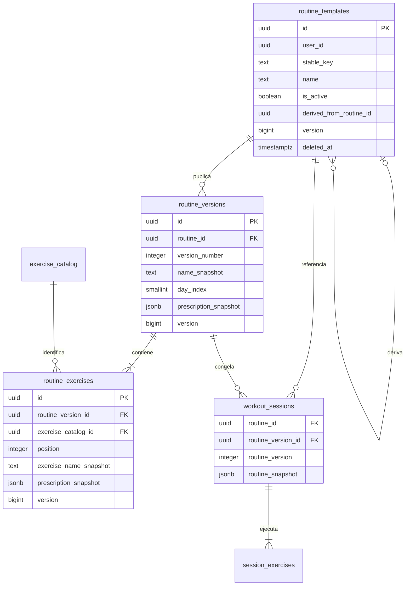

# Identidad y versiones de rutinas V3

Implementación en `feature/v3-routine-identity`, validada únicamente contra el proyecto descartable `nico-fit-v3-staging` (`tmydirzzlmlmtjgwqcgh`). No hay cutover, producción no fue tocada y V2 permanece intacto. Los flags `v3.routines.enabled` y `v3.routines.sync.enabled` están apagados por defecto. Ninguno habilita training, sync o Coach.

## Modelo resultante

`routine_templates.id` es la identidad lógica y no depende del nombre visible. Renombrar o activar/desactivar actualiza el template con control optimista normal. `stable_key` y el origen de una variante son inmutables.

Cada publicación crea un `routine_versions.id` nuevo y un `version_number` único dentro del template. La versión contiene el snapshot completo y ordenado; cada ocurrencia de ejercicio tiene UUID propio, por lo que un mismo ejercicio puede repetirse. `routine_exercises` conserva las referencias normalizadas a `exercise_catalog` para búsquedas y sync. Una versión y sus ejercicios publicados son inmutables, salvo su tombstone. Para cambiar prescripción u orden se publica otra versión.

La prescripción distingue `measurement_kind` (`reps` o `seconds`), series, mínimo/máximo, `target_rir`, descanso, incremento sugerido y notas. `null` se conserva distinto de `0`. Las APIs rechazan modo mixto en una versión concreta, rangos incompletos, unidades incompatibles con catálogo, valores fuera de rango, posiciones duplicadas y snapshots parciales.

Una sesión iniciada con rutina guarda simultáneamente `routine_id`, `routine_version`, `routine_version_id` y `routine_snapshot`. Los cuatro campos quedan inmutables. `session_exercises` sigue guardando snapshots por ocurrencia. Esto permite reconstruir una sesión aunque el template se renombre, se desactive, se borre suavemente o aparezcan versiones nuevas.

## Capa local e integración

- IndexedDB sube a versión 4 y agrega stores e índices para templates, versiones y ejercicios. La actualización conserva sesiones, cola, checkpoints y estado activo anteriores.
- `V3RoutineService` es la API del futuro editor: listar, resolver una versión, crear, publicar nueva versión, renombrar, activar/desactivar, duplicar y sembrar rutinas conocidas.
- `V3TrainingEngine.createSession({routineVersionId})` exige una versión completa, activa, con catálogo disponible y sin conflictos. La selección y el snapshot se confirman en la misma transacción local que crea la sesión.
- Una rutina con conflicto no inicia sesiones nuevas. Una sesión ya iniciada permanece editable y usa su snapshot congelado; el conflicto queda visible en el snapshot de entrenamiento.
- Coach y progresión buscan historial por `routine_id + routine_version` cuando esa identidad existe. No usan el nombre ni la versión actual del template. Sesiones legacy conservan la clasificación anterior por día.
- La UI mínima lista nombre, UUID lógico, versiones, estado activo/inactivo y conflictos. En una sesión muestra nombre histórico, UUID, versión, estado actual del template y el snapshot expandible. Usa APIs del servicio y DOM seguro.

## Sync y conflictos

Las tres entidades se suman al protocolo remoto como entidades versionadas normales, con UUID de cliente, `version`, timestamps y tombstones. El orden de descarga/subida es catálogo → template → versión → ejercicios → sesión → ejercicios de sesión → series.

`v3.routines.sync.enabled` controla tanto las tablas de rutina como cualquier sesión/grafo que las referencie. Con el flag apagado, el sync V3 existente puede seguir procesando datos legacy y señales, pero no envía ni trunca rutinas o sesiones relacionadas. Activar el flag local no activa el sync general.

Dos dispositivos pueden calcular el mismo `version_number`. La restricción remota lo rechaza; el adaptador lo traduce a PT409 y persiste `routine_version_number_collision`. No renumera ni usa last-write-wins. Como los UUID difieren, la única estrategia automática ofrecida es posponer; un editor futuro deberá publicar explícitamente una versión nueva después de revisar ambos snapshots.

Cambiar el nombre concurrentemente usa la versión remota base normal. Conflictos de template, versión, ocurrencia o catálogo aparecen vinculados a una sesión por UUID, pero nunca reescriben su snapshot histórico.

## Migración controlada desde V2

Las definiciones conocidas de martes, jueves y viernes usan UUIDv5 determinísticos por usuario, con versión inicial 1. La importación reutiliza `exercise_catalog.stable_key` existente, incluso si vino de V2 con unidad `mixed`; no busca por nombre ni cambia la fila importada. Dos ejercicios llamados igual con IDs estables distintos permanecen separados.

La siembra es idempotente. El mapa guarda origen, destino, estado, nota, payload y timestamp. La trazabilidad de sesiones legacy sólo marca `migrated` cuando cada ocurrencia coincide exactamente en cantidad, orden, ID fuente, snapshot y nombre con el plan validado. Una sesión modificada, parcial o sin tags queda `pending_review`; no se le agregan referencias de rutina retroactivamente. Una sesión que ya tiene identidad V3 queda `skipped`.

Duplicar una rutina crea template, versión y ocurrencias con UUID nuevos, `derived_from_routine_id` explícito y una copia idéntica de la prescripción inicial. A partir de allí las identidades son independientes.

## SQL

`supabase/migration-v3-routines.sql` es aditivo e idempotente. Crea las tres tablas, añade cuatro columnas opcionales a sesiones y agrega FKs compuestas con `user_id`, RLS, índices, triggers de versión/inmutabilidad y validación completa del snapshot. No renombra ni destruye tablas V2. No concede acceso API.

`supabase/staging-v3-routines-api-grants.sql` mantiene separados los grants de staging. Autoriza SELECT/INSERT/UPDATE a authenticated y revoca DELETE. No debe usarse como cutover productivo.

El trigger del servidor:

- rechaza inserts con versión distinta de 1 y updates obsoletos o con saltos;
- mantiene `created_at` y genera `updated_at` en servidor;
- bloquea la resurrección de tombstones;
- bloquea cambios a una prescripción publicada o referencia histórica de sesión;
- comprueba propiedad mediante el padre y el catálogo;
- exige que las filas de ejercicios coincidan exactamente con el snapshot completo;
- permite iniciar una sesión sólo con template activo y snapshot idéntico a la versión publicada.

## Resultados locales y staging — 2026-09-16

La suite específica contiene **23/23 tests** y la suite completa quedó en **191/191**. `node --check` pasó para los 80 archivos JavaScript/MJS y `git diff --check` no encontró errores. Cubre:

- upgrade de IndexedDB 3→4 sin pérdida;
- creación, nueva versión, versión N frente a N+1, rename, activación y duplicación;
- reordenamiento/repetición mediante versión nueva e inmutabilidad de la anterior;
- dos publicadores locales para el mismo número y colisión PT409 simulada de Supabase;
- catálogo V2 reutilizado por ID estable, dos nombres iguales que no se fusionan y conflicto de catálogo visible en la rutina;
- importación idempotente y `pending_review` ambiguo;
- sync paginado ida/vuelta e aislamiento del flag de rutinas;
- reload con sesión activa y snapshot exacto;
- conflicto visible sin bloquear la edición local de una sesión ya iniciada;
- Coach/progresión sin tomar historial de otra versión;
- DOM seguro y estado visible;
- migración ejecutada dos veces en PGlite, RLS de dos usuarios, anon rechazado, control de versiones, snapshots inmutables, historial intacto, soft delete y no resurrección.

La prueba manual en Edge usó IndexedDB nativo y cero cliente remoto: seleccionó explícitamente “Fuerza principal · versión 1”, inició una sesión, cambió el nombre del template, publicó versión 2, desactivó el template y recargó. La sesión siguió mostrando el nombre histórico, UUID lógico, versión 1, siete ocurrencias y el snapshot original. El estado del template se muestra separado. La fixture reproducible es `npm run serve:v3:routines:manual`.

El runner reproducible `npm run test:v3:routines:staging` pasó **9/9 escenarios** con publishable key y dos usuarios Auth. Verificó PostgREST y rechazo de anon, RLS, alta/lectura, orden, rename, desactivación, tombstone, snapshot histórico, duplicación, conflicto remoto/local, publicación concurrente, colisión de ordinal sin renumeración, paginación de una fila y sync bidireccional. La migración SQL se volvió a ejecutar desde el SQL Editor del mismo proyecto y finalizó con `Success. No rows returned`, confirmando idempotencia real.

Staging reveló dos diferencias respecto de PGlite/local. Primero, un insert cruzado puede ser rechazado por el `CHECK user_id = auth.uid()` con `23514` antes de que RLS produzca `42501`; en ambos casos no se crea ni se expone la fila. Segundo, cuando el ganador remoto de una publicación concurrente llega durante el pull, su UUID es distinto pero comparte `(routine_id, version_number)` con el borrador local. El sync ahora detecta esa colisión antes del índice único de IndexedDB y crea un conflicto explícito con ambos snapshots. También se toleran ejercicios históricos descargados con `exercise_catalog_id = null`, usando sus snapshots sin inventar identidad.

## Riesgos y decisión de staging

| Riesgo pendiente | Mitigación/validación requerida |
|---|---|
| Colisión de `version_number` con UUID distintos | El conflicto se conserva y no se renumera. El editor futuro necesita flujo explícito para comparar y publicar el siguiente número libre. |
| Grafo remoto parcialmente descargado durante una conexión interrumpida | Training exige snapshot y filas completas antes de iniciar; validar recuperación y paginación real en staging. |
| Rutinas antiguas personalizadas o editadas | Permanecen `pending_review`; definir revisión manual. No inferir por nombre o día. |
| Catálogo importado con unidad `mixed` | La versión exige `reps` o `seconds` explícitos sin mutar el catálogo; validar PostgREST/FK real. |
| Desactivar/borrar template con sesiones existentes | FKs RESTRICT y snapshots conservan historial; validar updates y tombstones reales. |
| Auditoría de conflictos de rutina | El esquema de auditoría acepta las entidades nuevas, pero su persistencia real debe probarse en staging. |
| Dispositivo y PWA | Siguen pendientes standalone PWA, teléfono físico y suspensión/contención prolongada. |
| Retención | Sigue pendiente la política de retención de auditoría antes de producción. |

**GO para commit/merge de esta rama y para comenzar `v3-cutover-prep` como trabajo de preparación. NO-GO para activar flags por defecto, deploy productivo o cutover.**
