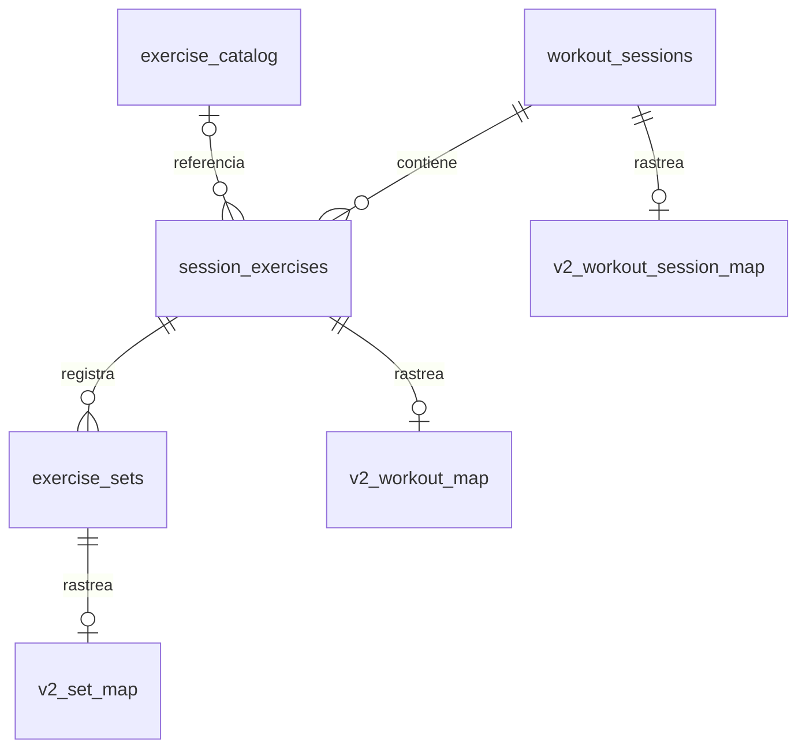

# Nico Fit V3: diseño de datos

V3 se agrega en el esquema `nico_fit_v3`. Las tablas V2 de `public` permanecen intactas y continúan siendo la única fuente usada por el frontend actual. La migración de esquema revoca todo acceso a `anon` y `authenticated`; esos permisos aparecen exclusivamente en `cutover-v3.sql`.

## Modelo

`workout_sessions` representa una ejecución concreta. Su UUID lo crea el cliente antes de guardar localmente, por lo que dos sesiones del mismo día no colisionan. `session_date` conserva el día local elegido al iniciar la sesión; `started_at` y `ended_at` representan instantes absolutos.

`session_exercises` representa una aparición de un ejercicio dentro de la sesión. `position` define el orden y no existe una restricción única sobre `exercise_catalog_id`, por lo que un ejercicio puede repetirse. El nombre y la prescripción quedan copiados en `exercise_name_snapshot` y `prescription_snapshot`.

`exercise_sets` distingue `load_kg`, `reps`, `duration_seconds` y `rir`. Repeticiones y duración son mutuamente excluyentes. Todos los valores opcionales admiten `NULL`; cero solo se acepta donde tiene significado, como carga externa de un ejercicio de peso corporal.

`exercise_catalog` admite entradas globales de solo lectura y entradas personales. `stable_key` mantiene la identidad de dominio, mientras `id` es el UUID usado por las relaciones.

Los cuatro IDs principales no tienen un default de base de datos. Los clientes V3 deberán generarlos antes de escribir. El backfill es la excepción: usa UUID deterministas derivados de IDs V2 para que pueda repetirse sin duplicar datos.

## Conflictos y borrados

Cada entidad sincronizable comienza con `version = 1`. Toda actualización debe enviar exactamente la versión anterior más uno. El trigger del servidor rechaza tanto versiones obsoletas como saltos con SQLSTATE `PT409`, que PostgREST expone como HTTP 409, fija `updated_at` en el servidor y conserva `created_at`.

Un borrado cambia `deleted_at` e incrementa la versión. `deleted_at` se conserva como tombstone durante toda la migración. Una vez eliminado, el registro queda inmutable para impedir que un dispositivo desactualizado lo restaure. RLS permite que el propietario descargue filas eliminadas; las consultas de producto deben pedir `deleted_at IS NULL`.

No se concede `DELETE` a `authenticated`. Los borrados físicos quedan reservados para operaciones administrativas posteriores a la ventana de sincronización.

## RLS

- Las sesiones verifican `user_id = auth.uid()`.
- Los ejercicios verifican la propiedad mediante su sesión padre.
- Las series recorren `session_exercise → workout_session` antes de autorizar lectura o escritura.
- El catálogo global puede leerse, pero solo el service role puede modificarlo.
- Un usuario solo puede crear o modificar entradas personales de catálogo con su propio `owner_user_id`.
- Las tablas de correspondencia son de solo lectura para el propietario y de escritura para el backfill/service role.

## Backfill

El backfill está separado en `supabase/backfill-v2-sessions.sql` y `supabase/backfill-v2-workouts.sql`. Sigue estas reglas:

1. Copia cada `public.workout_sessions` no eliminado a una sesión V3 con UUID determinista.
2. Solo asigna un `public.workouts` cuando existe exactamente una sesión V2 mapeada para el usuario y la fecha.
3. Usa el ID V2 para crear un orden sintético reproducible y marca el ejercicio `pending_review`; ese orden no se presenta como histórico real.
4. Conserva siempre el nombre V2 como snapshot.
5. Solo enlaza catálogo o interpreta `reps` como repeticiones/segundos si existe una fila `v2_exercise_name_map` aprobada.
6. Conserva el JSON original de cada origen en las tablas de correspondencia.
7. Omite registros cubiertos por tombstones al crear entidades V3.
8. Cada correspondencia guarda `migration_status`, `migration_note`, `source_payload`, `migration_started_at` y `migration_completed_at`.
9. Usa UUID deterministas y `ON CONFLICT DO NOTHING`; repetirlo no duplica entidades ni sobrescribe ediciones V3.

Antes de un backfill real se debe dejar converger la sincronización V2, hacer un backup y ejecutar primero en staging. La tabla `v2_exercise_name_map` se completa mediante revisión explícita, no mediante similitud textual.

## Casos ambiguos

El backfill no decide automáticamente:

- a qué sesión pertenece un ejercicio cuando hay varias sesiones el mismo día;
- cuántas veces apareció un ejercicio que V2 colapsó por fecha y nombre;
- el orden histórico original de los ejercicios;
- si `reps` representa repeticiones, segundos o minutos;
- si un cero V2 era un valor real o un campo vacío convertido por JavaScript;
- identidades de catálogo basadas únicamente en nombres parecidos;
- el huso horario de una fecha sin timestamp;
- cómo corregir sesiones con duración y timestamps incompatibles;
- cómo crear una sesión ausente para ejercicios V2 sueltos;
- cómo resolver una fila y un tombstone con historial temporal incompleto.

Esos registros quedan como `pending_review` o `skipped`, con el origen disponible para una migración asistida.

## Separación de etapas

| Etapa | Archivo | Acceso de clientes |
|---|---|---|
| Crear estructura, triggers y RLS | `migration-v3-schema.sql` | Revocado |
| Copiar sesiones V2 | `backfill-v2-sessions.sql` | Revocado |
| Copiar ejercicios y series no ambiguos | `backfill-v2-workouts.sql` | Revocado |
| Habilitar un cliente V3 futuro | `cutover-v3.sql` | Concede solo SELECT/INSERT/UPDATE |

El esquema no debe agregarse a los esquemas expuestos de PostgREST hasta el cutover. El frontend V2 no se modifica en esta rama. El script de cutover también exige que el operador configure `nico_fit.allow_v3_cutover=approved` dentro de la transacción, para que una ejecución accidental falle antes de conceder permisos.

## Matriz de riesgos y supuestos

| Riesgo o supuesto | Impacto | Tratamiento |
|---|---|---|
| V2 ya usa `public.workout_sessions` | Colisión de nombre | V3 vive en `nico_fit_v3` |
| Dos clientes editan la misma versión | Pérdida de datos | Trigger exige incremento exacto `+1` y rechaza el segundo escritor |
| Un cliente offline intenta restaurar un borrado | Resurrección | Tombstone permanente e inmutable; no se concede DELETE físico |
| Varias sesiones V2 coinciden con un workout | Asociación incorrecta | Se marca `skipped`; no se crea relación |
| V2 no registra orden de ejercicios | Orden histórico falso | Posición sintética marcada `pending_review` |
| V2 mezcla reps y tiempo | Métricas incorrectas | Columnas tipadas quedan `NULL` hasta aprobar el mapeo |
| V2 convirtió vacío a cero | Semántica incierta | Cero ambiguo no se transforma automáticamente |
| Nombre parecido a un catálogo existente | Historial mezclado | Solo se enlazan mappings aprobados |
| El esquema custom no está expuesto por Supabase | Cliente V3 sin acceso | Exponerlo es una acción explícita del cutover futuro |
| Rollback después de escrituras exclusivas V3 | Pérdida de datos nuevos | Detener escritores y exportar V3 antes del rollback |
| Un backfill se reejecuta | Duplicados o sobrescritura | UUID deterministas, mapas únicos y `ON CONFLICT DO NOTHING` |
| Borrado físico administrativo prematuro | Dispositivos desactualizados | Mantener tombstones durante toda la migración y definir retención después |

Supuestos: V2 está desplegado antes de crear V3; `auth.users`, `public.workouts`, `public.workout_sessions` y `public.sync_tombstones` existen; los IDs bigint V2 son estables; el backfill se ejecutará con service role en staging después de un backup y de converger la sincronización V2.

## Rollback

Mientras el frontend siga escribiendo V2, el rollback consiste en dejar de exponer `nico_fit_v3` y ejecutar `supabase/rollback-v3-schema.sql`. El script solo elimina objetos dentro del esquema V3. No modifica `public.workouts`, `public.workout_sessions`, `sync_tombstones` ni otras tablas V2.

Si V3 ya recibiera escrituras exclusivas en el futuro, primero habrá que detener los escritores y exportar esas filas. El rollback aditivo actual no convierte datos V3 nuevos a V2.

## Validación

- `supabase/test-v3-idempotency.psql` aplica la migración dos veces dentro de una transacción descartable.
- `supabase/test-v3-schema.sql` prueba RLS, duplicados, sesiones múltiples, ejercicios repetidos, soft delete, conflictos e integridad referencial y termina con `ROLLBACK`.
- `test/v3-schema-files.test.js` verifica en CI la separación de etapas, las columnas de trazabilidad, el control de versiones y la ausencia de permisos V3 para V2.
- Ambos archivos están destinados a una base Supabase local o de staging. Nunca deben ejecutarse por primera vez en producción.
