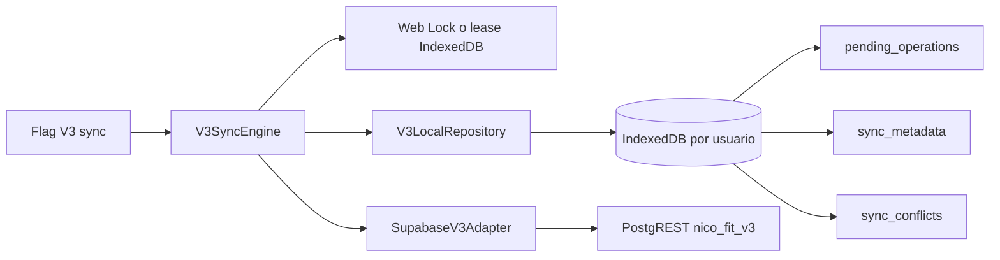

# Nico Fit V3: motor de sincronización

## Alcance

El motor sincroniza la base IndexedDB V3 de un usuario autenticado con el esquema `nico_fit_v3`. No se importa desde `js/app.js`, no modifica `js/sync.js` y no reemplaza el camino V2. El flag `nicoFit.v3.sync.enabled` está apagado por defecto y es independiente del flag de almacenamiento local.

El runner alojado acepta únicamente el proyecto descartable `nico-fit-v3-staging` (`tmydirzzlmlmtjgwqcgh`), rechaza el ref productivo `xaklsoqyzwowtjwcpwmb`, una URL que no coincida y cualquier clave `sb_secret_` o JWT con rol `service_role`.

## Arquitectura



- `sync-engine.js` coordina un ciclo pull-before-push.
- `supabase-v3-adapter.js` traduce el protocolo a `supabase-js`, pagina y usa el esquema explícito.
- `sync-protocol.js` limita campos remotos, aplica versiones, clasifica errores y compacta operaciones.
- `sync-lock.js` usa Web Locks cuando existe. El fallback adquiere un lease atómico en la base del usuario, lo renueva y permite recuperar leases vencidos.
- El repositorio conserva checkpoints, conflictos, backoff, lease y aplicación remota en stores IndexedDB persistentes.

## Protocolo de un ciclo

1. Comprobar el flag y pedir a Supabase el usuario de la sesión actual.
2. Rechazar la ejecución si el UUID autenticado no coincide con la base local.
3. Adquirir `nico-fit-v3-sync:<user-id>` mediante Web Locks o lease.
4. Recuperar operaciones que quedaron `syncing` y reactivar fallos cuyo backoff venció.
5. Descargar todas las páginas incrementales, ordenadas por `(updated_at, id)`, y aplicar tombstones antes que filas activas dentro de cada página.
6. Avanzar el checkpoint de una entidad sólo después de procesar su página completa.
7. Si una fila remota coincide con la mutación que perdió su confirmación, confirmar la cola idempotentemente.
8. Si el servidor conserva exactamente la versión base de un borrador local, mantener el borrador para el push.
9. Si servidor y cliente avanzaron la misma entidad, guardar un conflicto; nunca sobrescribir el borrador.
10. Reclamar la cola en una transacción, compactar grupos seguros y enviarlos en orden.
11. Marcar `synced` únicamente después de recibir y guardar la fila confirmada por el servidor.

Los inserts conservan el UUID local y envían `version = 1`. Updates y soft deletes envían `base_remote_version + 1`. Una repetición posterior a una respuesta perdida consulta el UUID remoto; sólo se considera exitosa si versión y contenido confirman exactamente la operación.

## Conflictos y reintentos

`PT409`, HTTP 409 y el rechazo `55000` de un tombstone inmutable se guardan como conflictos. Cada conflicto conserva entidad, ID, operaciones relacionadas, payload local, payload remoto, error y timestamps. Las operaciones quedan en `conflict` sin reintento automático.

Los errores de red, 408, 425, 429 y 5xx quedan `failed` con backoff exponencial y jitter. Al vencer el plazo vuelven a `pending`; después del máximo configurado permanecen `failed`. Una sesión expirada detiene el ciclo antes de leer o reclamar la cola.

La compactación sólo combina operaciones consecutivas del mismo registro y la misma versión base. Varios updates se convierten en un update con el payload más reciente. Insert más ediciones continúa siendo un insert. Un soft delete final se conserva siempre, incluido cuando se compacta con un insert aún no enviado.

## Activación interna

La aplicación V2 no activa ni importa estos módulos. Una prueba interna debe habilitar ambos flags, construir un cliente Supabase con la publishable key y una sesión autenticada, y pasar ese cliente al adaptador:

```js
const storage = await import('./js/v3/client-storage.js');
const sync = await import('./js/v3/client-sync.js');
storage.setV3LocalStorageEnabled(true);
sync.setV3SyncEnabled(true);
const repository = await storage.V3LocalRepository.open({userId});
const remote = new sync.SupabaseV3Adapter({client: supabase});
const engine = new sync.V3SyncEngine({repository, remote});
await engine.syncOnce();
```

No se incluye URL, key, contraseña ni sesión en el bundle. El cliente debe recibir una publishable key y la sesión normal de Auth.

## Pruebas

```powershell
npm run test:v3:sync
npm test
npm run test:v3:sync:staging
node --check js/v3/sync-engine.js
git diff --check
```

El runner staging crea una sesión con UUID aleatorio, la descarga en un segundo IndexedDB, prueba update, conflicto entre dispositivos, soft delete, repetición idempotente, paginación y sesión expirada. Deja únicamente un tombstone sintético en el proyecto descartable.

Resultados de esta rama:

- Suite completa: 71/71 pruebas aprobadas.
- Motor V3: 18/18 pruebas aprobadas.
- Integración del motor en `nico-fit-v3-staging`: 7/7 pasos aprobados.
- Suite Supabase staging existente: 7/7 pasos aprobados, incluidos Auth/RLS con dos usuarios y rechazo de `anon`.
- Dry run PGlite, sintaxis JavaScript y `git diff --check`: aprobados.

## Riesgos abiertos

- Falta una UI para comparar y resolver `sync_conflicts`; por eso los conflictos quedan detenidos.
- Los Web Locks no coordinan dispositivos diferentes; la versión del servidor es la autoridad para ese caso.
- Un lease sólo protege instancias que usan este motor. El TTL debe superar solicitudes normales y se renueva durante el ciclo.
- La cola conserva todas las operaciones como auditoría aunque envíe grupos compactados; bases grandes necesitarán una política de retención para operaciones `synced`.
- El esquema actual no ofrece un feed global monotónico. El cursor `(updated_at, id)` depende del reloj y timestamp del servidor, validado en staging, pero antes del cutover conviene evaluar un changelog secuencial para volúmenes altos.
- El motor todavía no está conectado a eventos de red, login, foreground ni UI; sólo se ejecuta mediante llamada explícita.

## Criterio para `feature/v3-training-engine`

**GO para comenzar el motor de entrenamiento detrás de flags**, porque el almacenamiento y la sincronización aislada pasan tests unitarios y staging con Auth/RLS reales.

**NO-GO para cutover o producción** hasta implementar resolución visible de conflictos, observabilidad de cola/checkpoints, política de retención, pruebas PWA multidispositivo prolongadas y un ensayo de migración con inventario de producción y rollback aprobado.
