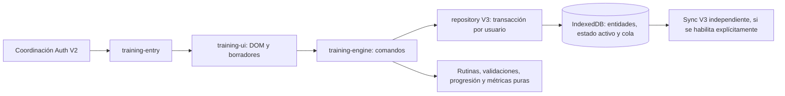

# Motor de entrenamiento V3 local

## Alcance y activación

V2 sigue siendo el camino por defecto. El motor no crea un cliente Supabase ni
activa sincronización. No se modifican SQL, RLS, `js/sync.js` ni `js/store.js`.

Para pruebas internas en un origen local seguro, habilitar explícitamente ambos
flags y recargar:

```js
localStorage.setItem('nicoFit.v3.localStorage.enabled', 'true');
localStorage.setItem('v3.training.enabled', 'true');
location.reload();
```

La pantalla requiere un usuario autenticado de V2. `v3.sync.enabled` conserva su
configuración independiente: estos flags no lo habilitan. Deshabilitar training
oculta la pantalla sin eliminar sus datos. Nunca habilitar sync productivo como
parte de esta prueba.

## Arquitectura y flujo



El repository guarda cambios del grafo, operaciones de la cola y estado activo
en una sola transacción. Los guards de revisión y posiciones únicas rechazan
cambios concurrentes incompatibles sin guardar parcialmente el grafo.

Cada ejercicio de sesión tiene UUID propio, referencia al catálogo y snapshot
de nombre/prescripción. Repetir un ejercicio crea otra ocurrencia; sus series
no se comparten. Los IDs de catálogo de rutinas se derivan del usuario y stable
ID de V2; los personalizados reciben UUID y stable key propios.

Las rutinas son prescripciones versionadas en código, copiadas a la sesión.
No se agrega una tabla remota de rutinas. Los ejercicios temporizados se
declaran explícitamente; la movilidad se expresa en segundos. El usuario puede
crear ejercicios de reps, segundos o elección por serie.

## Sesión activa y guardado

Los metadatos por usuario conservan sesión, ejercicio actual, vista, serie en
edición, borradores y RPE/notas pendientes. El reload restaura ese estado. El
reloj se calcula desde `started_at` y el tiempo real. La fecha capturada no se
reescribe al cambiar de día. Nuevas sesiones reciben la fecha vigente.

Los inputs guardan borradores sin crear operaciones remotas. El refresco de
tiempo/conflictos no reconstruye el formulario. Finalizar exige RPE válido,
al menos una serie completada y ningún borrador de serie pendiente. Guarda
sesión finalizada, duración y cola antes de limpiar el estado activo. Si falla
IndexedDB, conserva sesión/resumen para reintentar. Un guardado local exitoso
no se presenta como confirmación remota.

El motor permite varias sesiones por día; la UI recupera sesiones draft sin
ofrecer iniciar otra mientras hay una activa. El cierre de la pantalla y el
cambio de usuario vacían el DOM y esperan las escrituras iniciadas antes de
cerrar el repository.

## Series, progresión y métricas

- `null` conserva información desconocida; carga/RIR `0` siguen siendo cero.
- Cada serie contiene reps **o** segundos, carga opcional, RIR opcional,
  completion flag y timestamp. No se infieren reps desde duración.
- Ediciones de una serie completada conservan su timestamp; desmarcarla lo
  limpia, volver a completarla registra uno nuevo.
- Borrar es soft delete; borrar ejercicio tombstonea sus series atómicamente.
- Progresión reutiliza V2: martes/jueves diferenciados, objetivo completo antes
  de subir carga y viernes/prepartido prioritario. Compara la misma identidad y
  ordinal de ocurrencia en sesiones finalizadas; no suma ejercicios repetidos.
- Volumen, reps, carga máxima y series cuentan solamente series completadas
  no borradas. La duración de sesión usa timestamps; la duración de ejercicios
  suma segundos registrados. RPE es el informado al finalizar.
- PR estimado usa Epley sobre series cargadas de hasta 12 reps. Es una
  estimación, no un PR medido. Reps registradas no representan una inferencia
  fisiológica de «repeticiones efectivas».

## Cola, orden y conflictos

Reordenar mantiene el orden final local atómicamente. La cola conserva dos
fases: posiciones temporales únicas altas, luego posiciones finales. Se impide
compactar esas transiciones para respetar los índices únicos del esquema.
El sync relee las operaciones reclamadas después de cada confirmación: así
usa la versión base actualizada por un insert/update previo del mismo batch.

Un conflicto de la entidad o sus padres se muestra sin reemplazar el registro
local. El usuario puede continuar escribiendo; esas nuevas operaciones quedan
en `conflict`, con payload local actualizado y payload remoto conservado. No
se reintentan automáticamente ni se declara last-write-wins. Esta entrega no
incluye UI de resolución de conflictos.

## Validación reproducible

```powershell
npm test
npm run test:v3:training
npm run test:v3:dry-run
rg --files js test scripts -g '*.js' -g '*.mjs' | ForEach-Object { node --check $_; if ($LASTEXITCODE) { throw "Sintaxis inválida: $_" } }
node --check sw.js
git diff --check
```

Suite completa: 92/92; entrenamiento: 21/21. Cubre creación, sesiones del mismo
día, repetición, reordenamiento, sets/edit/delete, unidades/null/0, recuperación,
finalización y fallos, métricas, progresión, cambio de día, conflictos,
rollback transaccional, dos instancias y grafo offline seguido de sync simulado
con versiones/posiciones únicas y batches pequeños. Validación de sintaxis y
`git diff --check`: sin errores. Dry run PGlite: 15/15 pasos exitosos, incluyendo
RLS, versiones, idempotencia y rollback con V2 intacta; sin SQL remoto.

Prueba manual en Edge con fixture sintético e IndexedDB independiente: crear
sesión personalizada, registrar carga 50/reps 10/RIR 0, editar a 12, reload con
borrador de 8 reps, excluirlo del volumen (600 kg), rechazo de finalización con
borrador pendiente, guardado de serie incompleta y finalización con RPE 7/notas
con aviso de confirmación remota pendiente. Consola sin errores. No se usó Supabase ni Auth
real para ese fixture. El cierre completo de PWA instalada/HTTPS y una sesión
larga con pantalla bloqueada siguen pendientes.

## Riesgos y criterio para coach

| Riesgo | Decisión / validación pendiente |
| --- | --- |
| Reordenamiento interrumpido remotamente | Puede observarse orden temporal entre fases; cola recuperable. Validar este flujo en staging antes de activar sync de entrenamiento. |
| Conflictos | Datos locales usables y cambios bloqueados; falta resolución explícita antes de cutover. |
| Catálogo/prescripciones | Revisar ejercicios compuestos y unidades temporizadas antes de recomendaciones automáticas de coach. |
| Historial extenso | Consultas locales cargan grafos para métricas/PR; evaluar índices/agregación con datos representativos. |
| Durabilidad del navegador | IndexedDB puede sufrir cuota/evicción; no se promete respaldo remoto con sync apagado. |
| Dos pestañas editando | Guards y posiciones evitan colisiones; el usuario debe recargar tras un rechazo de revisión. |

GO para empezar `feature/v3-coach` como dominio local detrás de flags: suite,
validaciones y flujo manual local exitosos, recomendaciones conservadoras y
sin sobrescritura de conflictos. NO-GO para cutover/uso remoto productivo hasta
validar el grafo de entrenamiento en staging, resolución de conflictos y PWA
instalada. Coach debe consumir snapshots/completed sets y producir sugerencias
explicables; nunca aplicar aumentos ni resolver conflictos silenciosamente.
